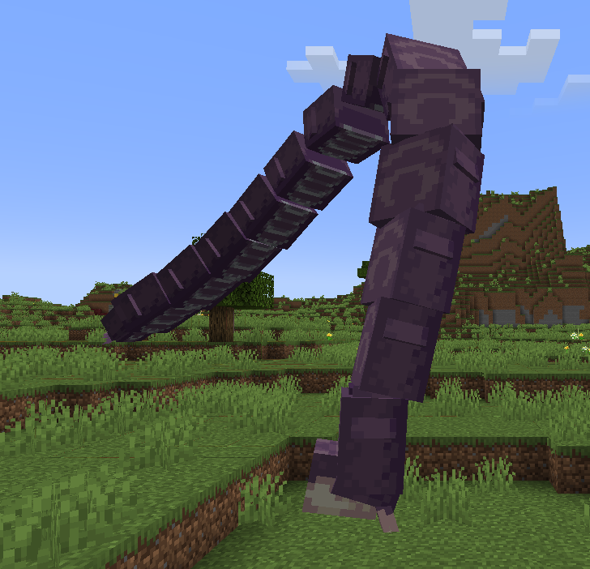
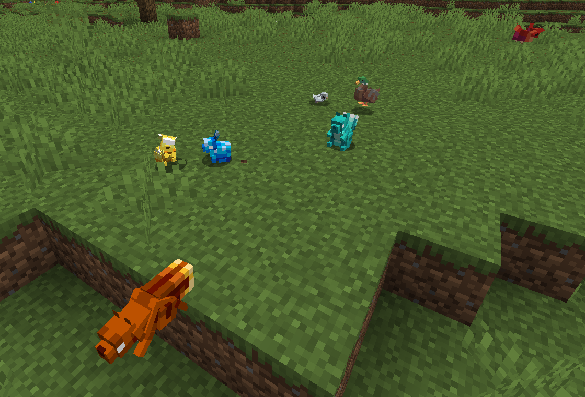
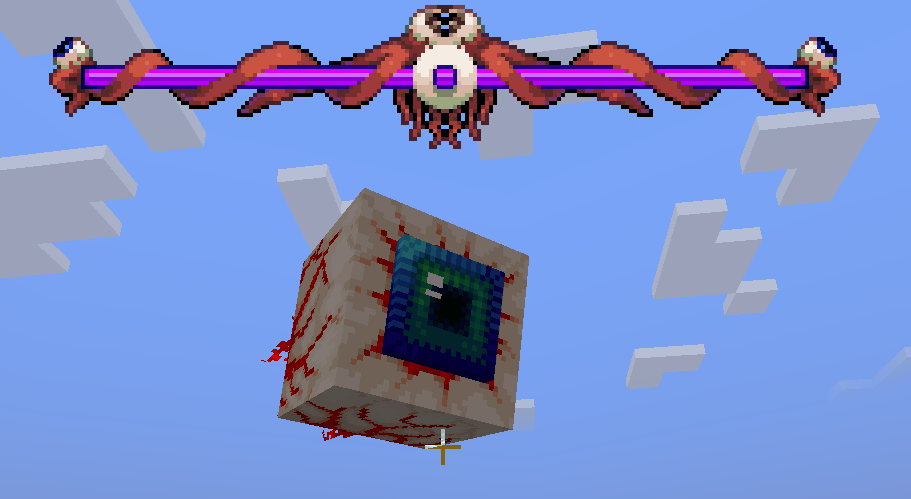
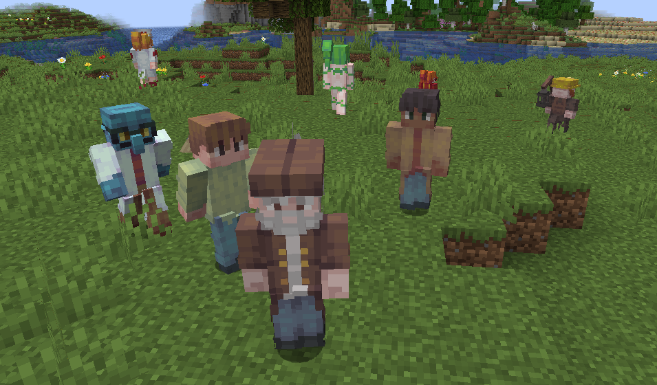
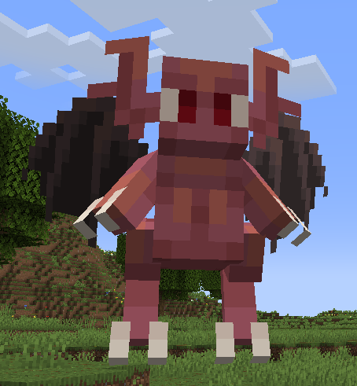
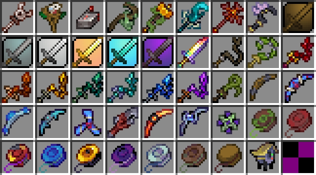
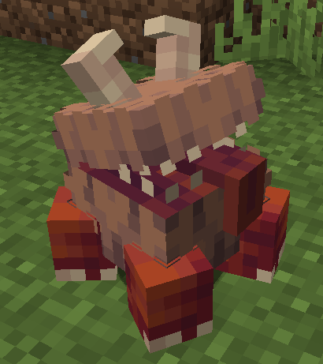
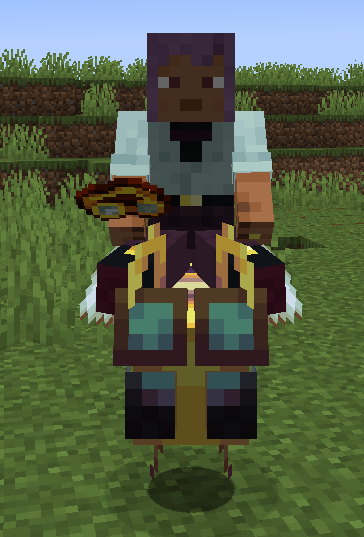
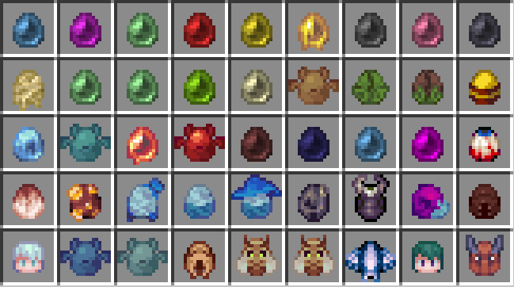
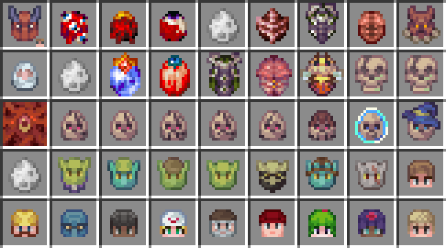

# Terra Entity -- submodule of Confluence: OtherWorld

lang: [中文](./README_zh.md) | [English](./README.md)
___ 
## Mod Contents

- **[Creatures](#a-classemojia-span-classtextcreaturesspan)**
    - [Monsters](#span-classtextmonstersspan-a-classemoji-a)
    - [Animals](#span-classtextanimalsspan-a-classemoji-a)
    - [Bosses](#span-classtextbossesspan-a-classemoji-a)
    - [NPCs](#span-classtextnpcsspan-a-classemoji-a)
    - [Summonings](#span-classtextsummoningsspan-a-classemoji-a)

- **Items**
    - **[Weapons](#a-classemoji-a-span-classtextweaponsspan)**
        - [Yoyos](#yoyos-)
        - [Boomerangs](#boomerangs-)
        - [Summoning staffs](#summoning-staffs-)
        - [Whips](#whips-)

    - **[Enchant Books](#a-classemoji-a-span-classtextenchant-booksspan)**
        - [Whip Sweep](#whip-sweep)
        - [Multi Boomerang](#multi-boomerang)

    - **[Tools](#a-classemoji-a-span-classtexttoolsspan)**
        - [House Detector](#span-classtexthouse-detectorspan-a-classemoji-a)
        - [Pets](#span-classtextpetsspan-a-classemoji-a)
        - [Rideable](#span-classtextrideablespan-a-classemoji-a)

    - **[Spawn Eggs](#a-classemojia-span-classtextspawn-eggsspan-)**

- **[Gameplay](#a-classemojiaspan-classtextgameplayspan)**
  - [NPC System](#npc-system-)
  - [Summoning System](#summoning-system-)
  - [Configuration Files](#configuration-files-)
___

## <a class="emoji">🧬</a> Creatures

###  Monsters <a class="emoji">😈 </a>

  

- Slime 14 variants
- Demon Eye 14 variants
- Bat 5 kinds
- Goblin 7 kinds
- Skeleton 7 kinds
- Worm 3 kinds
- Hornet 
- Fly Fish、Crimson Kemera... 5 kinds
- Giant Shelly 2 variants
- Variant Zombies 4 kinds
- Decayeder
- Antlion Swarmer 2 kinds
- Nymph
- Harpy
- Demon 2 kinds
- Ghost
- Snow Flinx
- Fire Imp
- Bloody Spore
- Blood Crawler
- Cursed Skeleton
- Man Easter、Snatcher
- piranha

###  Animals <a class="emoji">🐰 </a>

  

- Dusk
- Squirrel 2 variants
- Jewel Squirrel 8 variants
- Bunny
- Jewel Bunny 8 variants
- Bird 3 kinds

### Bosses <a class="emoji">🤡 </a>

  

- King Slime
- Eye of Cthulhu
- Eater of Worlds
- Queen Bee
- Skeletron
- Wall of Flesh

### NPCs <a class="emoji">😆 </a>

  

- Guide、Merchant、Nurse、Goblin Thinkerer、Demolitionist、Arms Dealer、Fish Man... 17 kinds

### Summonings <a class="emoji">🐣 </a>

  

- Finch Staff
- Iron Golem Staff
- Slime_ Staff
- Hornet Staff
- Sculk Wisp Staff
- Imp Staff
- Snow Flinx Staff
- Summon Sword 6 kinds
- Terraprism 

---
## <a class="emoji">⚔️ </a> Weapons

  

### Yoyos 🪀

Long press the mouse to shoot, and scroll the mouse wheel to change the range. You can lock onto the target pointed by the nearest pointer.

### Boomerangs 🪃

Right-click to fire, and it will fly for a period of time before returning to the player's hand.

### Summoning staffs 🪄

Right-click to fire, and it will fly for a while before returning to the player's hand.

### Whips 🪢

Right-click to whip all targets within range, causing the summonings to deal additional damage to the targets.

---
## <a class="emoji">📕 </a> Enchant Books

### Whip Sweep

The whip can sweep all targets within its range.

### Multi Boomerang

You can fire an additional boomerang.

---
## <a class="emoji">🔧 </a> Tools

### House Detector <a class="emoji">🏠 </a>

It has three modes: detecting houses, adding houses (requires prior detection), and deleting houses. Right-click on NPCs to add houses, allowing NPCs to move in.

### Pets <a class="emoji">🐕 </a>

- Chester, Wallet: They allow remote connection to containers and ender chests.  

  

### Rideable <a class="emoji">🐎 </a>

Right-click to summon a pet mount, and press shift to recall the pet.
- Slime
- Bee

  

--- 
## <a class="emoji">🥚</a> Spawn Eggs 

    
    

---
## <a class="emoji">📖</a>Gameplay
### NPC System 🙋‍♂️
- Trade  (data/terra_entity/npc/shop/)
- Mood   (data/terra_entity/npc/moods.json)
- Dialog (data/terra_entity/npc/dialogs.json)
- Chat   (data/terra_entity/npc/chat/)
- Name   (data/terra_entity/npc/names.json)

### Summoning System 🧙🏻
- Summon Damage: Whips and Summonings cause base damage.  
- Mark Damage: Summonings cause additional damage when handholding a whip.  
- Minion Capacity: Maximum number of minions that can be summoned. 

### Configuration Files ⚙️
- Common Configuration (config/terra_entity-common.toml)
- Client Configuration (config/terra_entity-client.toml)
- Attribute Configuration (config/terra_entity/attribute_config.json)

